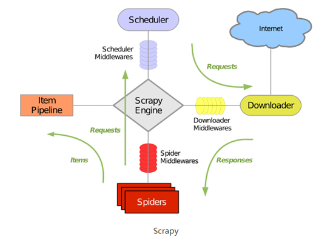
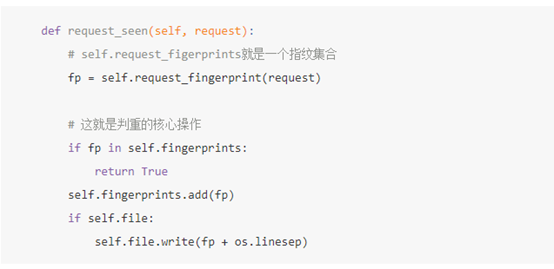
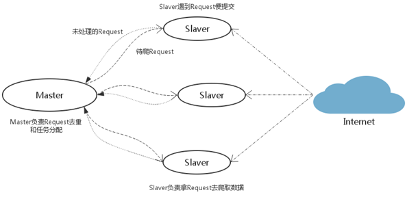

# Scrapy-Redis分布式

> Scrapy是python界出名的一个爬虫框架。
> Scrapy是一个为了爬取网站数据，提取结构性数据而编写的应用框架。
> 可以应用在包括数据挖掘，信息处理或存储历史数据等一系列的程序中。
> 虽然scrapy能做的事情很多，但是要做到大规模的分布式应用则捉襟见肘。
> 有能人改变了scrapy的队列调度，将起始的网址从start_urls里分离出来，改为从redis读取，多个客户端可以同时读取同一个redis，从而实现了分布式的爬虫。

## 安装

安装：`pip install scrapy-redis` 官方站点：[https://github.com/rolando/scrapy-redis][https://github.com/rolando/scrapy-redis]

## Scrapy-Redis架构



## scrapy-Redis组件详解

> 如上图所示，scrapy-redis在scrapy的架构上增加了redis，基于redis的特性拓展了如下四种组件：

> 1、Scheduler： scrapy改造了python本来的collection.deque(双向队列)形成了自己的Scrapy queue，但是Scrapy多个spider不能共享待爬取队列Scrapy queue，即Scrapy本身不支持爬虫分布式，scrapy-redis 的解决是把这个Scrapy queue换成redis数据库（也是指redis队列），从同一个redis-server存放要爬取的request，便能让多个spider去同一个数据库里读取。Scrapy中跟“待爬队列”直接相关的就是调度器Scheduler，它负责对新的request进行入列操作（加入Scrapy queue），取出下一个要爬取的request（从Scrapy queue中取出）等操作。它把待爬队列按照优先级建立了一个字典结构，然后根据request中的优先级，来决定该入哪个队列，出列时则按优先级较小的优先出列。为了管理这个比较高级的队列字典，Scheduler需要提供一系列的方法。但是原来的Scheduler已经无法使用，所以使用Scrapy-redis的scheduler组件。

> 2、Duplication Filter Scrapy中用集合实现这个request去重功能，Scrapy中把已经发送的request指纹放入到一个集合中，把下一个request的指纹拿到集合中比对，如果该指纹存在于集合中，说明这个request发送过了，如果没有则继续操作。这个核心的判重功能是这样实现的：
>
> 
>
> 在scrapy-redis中去重是由Duplication Filter组件来实现的，它通过redis的set不重复的特性，巧妙的实现了DuplicationFilter去重。scrapy-redis调度器从引擎接受request，将request的指纹存入redis的set检查是否重复，并将不重复的request push写入redis的 request queue。 引擎请求request(Spider发出的）时，调度器从redis的request queue队列里根据优先级pop 出⼀个request 返回给引擎，引擎将此request发给spider处理。

> 3、Item Pipeline： 引擎将(Spider返回的)爬取到的Item给Item Pipeline，scrapy-redis 的Item Pipeline将爬取到的 Item 存入redis的 items queue。修改过Item Pipeline可以很方便的根据 key 从 items queue 提取item，从而实现 items processes集群。

> 4、Base Spider 不在使用scrapy原有的Spider类，重写的RedisSpider继承了Spider和RedisMixin这两个类，RedisMixin是用来从redis读取url的类。 当我们生成一个Spider继承RedisSpider时，调用setup_redis函数，这个函数会去连接redis数据库，然后会设置signals(信号)：一个是当spider空闲时候的signal，会调用spider_idle函数，这个函数调用schedule_next_request函数，保证spider是一直活着的状态，并且抛出DontCloseSpider异常。一个是当抓到一个item时的signal，会调用item_scraped函数，这个函数会调用schedule_next_request函数，获取下一个request。

> 5、 总结 总结一下scrapy-redis的总体思路：这套组件通过重写scheduler和spider类，实现了调度、spider启动和redis的交互；实现新的dupefilter和queue类，达到了判重和调度容器和redis的交互，因为每个主机上的爬虫进程都访问同一个redis数据库，所以调度和判重都统一进行统一管理，达到了分布式爬虫的目的；当spider被初始化时，同时会初始化一个对应的scheduler对象，这个调度器对象通过读取settings，配置好自己的调度容器queue和判重工具dupefilter； 每当一个spider产出一个request的时候，scrapy引擎会把这个reuqest递交给这个spider对应的scheduler对象进行调度，scheduler对象通过访问redis对request进行判重，如果不重复就把他添加进redis中的调度器队列里。当调度条件满足时，scheduler对象就从redis的调度器队列中取出一个request发送给spider，让他爬取； 当spider爬取的所有暂时可用url之后，scheduler发现这个spider对应的redis的调度器队列空了，于是触发信号spider_idle，spider收到这个信号之后，直接连接redis读取strart_url池，拿去新的一批url入口，然后再次重复上边的工作。

## Scrapy-Redis分布式策略：

> Slaver端从Master端拿任务（Request/url/ID）进行数据抓取，在抓取数据的同时也生成新任务，并将任务抛给Master。Master端只有一个Redis数据库，负责对Slaver提交的任务进行去重、加入待爬队列。

> 优点：scrapy-redis默认使用的就是这种策略，我们实现起来很简单，因为任务调度等工作scrapy-redis都已经帮我们做好了，我们只需要继承RedisSpider、指定redis_key就行了。

> 缺点：scrapy-redis调度的任务是Request对象，里面信息量比较大（不仅包含url，还有callback函数、headers等信息），导致的结果就是会降低爬虫速度、而且会占用Redis大量的存储空间。当然我们可以重写方法实现调度url。



## 文件配置

### scrapy_demo/settings.py

```python
# 配置 scrapy-redis 爬虫信息
DUPEFILTER_CLASS = "scrapy_redis.dupefilter.RFPDupeFilter"
SCHEDULER = "scrapy_redis.scheduler.Scheduler"
SCHEDULER_PERSIST = True
# SCHEDULER_QUEUE_CLASS = "scrapy_redis.queue.SpiderPriorityQueue"
# SCHEDULER_QUEUE_CLASS = "scrapy_redis.queue.SpiderQueue"
# SCHEDULER_QUEUE_CLASS = "scrapy_redis.queue.SpiderStack"

# 配置 scrapy-redis 链接信息
REDIS_HOST = '127.0.0.1'
REDIS_PORT = 6379
REDIS_ENCODING = 'utf-8'
# REDIS_PARAMS = {'password': 'abcd@1234'}
```

### scrapy_demo/spiders/gushiwen.py

> 原始的scrapy写法

```python
'''
redis 配置
'''
import re
import scrapy
from urllib.parse import urljoin
from scrapy.http import HtmlResponse


class SwSpider(scrapy.Spider):
    name = 'gushiwen'
    allowed_domains = ['gushiwen.com']
    start_urls = ['https://gushiwen.com/type/n/n/n/n.html']

    def parse(self, response: HtmlResponse, **kwargs):
        for a in response.xpath("//ul[@class='i_gx']/li"):
            href = urljoin(self.start_urls[0], a.xpath(".//div[@class='ycd']/h2/a/@href").get())
            yield scrapy.Request(
                url=href,
                callback=self.parse_xq
            )
        if next_url := response.xpath('//a[contains(text(), "下一页 >")]/@href').get():
            yield scrapy.Request(
                url=urljoin(self.start_urls[0], next_url),
                callback=self.parse
            )

    def parse_xq(self, response: HtmlResponse, **kwargs):
        yield {
            'href':    response.url,
            'author':  re.findall(r'.*?原文、翻译及赏析-.*?-(.*?)-古诗文网', response.xpath("/html/head/title/text()").get())[0],
            'title':   response.xpath("//div[@id='main']/h1/text()").get(),
            'chaodai': response.xpath(f"//div[@class='f12']/p[1]/text()").get().replace('朝代：', ''),
            'content': response.xpath("//div[@class='view']//text()").get().replace('\n', '').replace('\r', '').replace(
                '\r\n', '').replace('\n', '').replace('\u3000', '').replace('\xa0', '').replace(' ', '')
        }
```