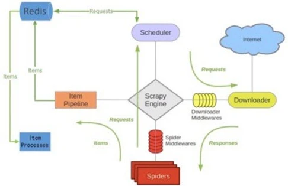

# Scrapy爬虫框架

> Scrapy是一个为了爬取网站数据，提取结构性数据而编写的应用框架。
> 可以应用在包括数据挖掘，信息处理或存储历史数据等一系列的程序中。
> 其最初是为了页面抓取 (更确切来说, 网络抓取 )所设计的， 
> 也可以应用在获取API所返回的数据(例如 Amazon Associates Web Services ) 
> 或者通用的网络爬虫。Scrapy用途广泛，可以用于数据挖掘、监测和自动化测试。

## 一、scrapy整体架构图

## 二、Scrapy主要组件
> 1、引擎(Scrapy): 用来处理整个系统的数据流处理, 触发事务(框架核心)。
>
> 2、调度器(Scheduler): 用来接受引擎发过来的请求, 压入队列中, 并在引擎再次请求的时候返回. 可以想像成一个URL（抓取网页的网址或者说是链接）的优先队列, 由它来决定下一个要抓取的网址是什么, 同时去除重复的网址。
>
> 3、下载器(Downloader): 用于下载网页内容, 并将网页内容返回给蜘蛛(Scrapy下载器是建立在twisted这个高效的异步模型上的)。
>
> 4、爬虫(Spiders): 爬虫是主要干活的, 用于从特定的网页中提取自己需要的信息, 即所谓的实体(Item)。用户也可以从中提取出链接,让Scrapy继续抓取下一个页面。
>
> 5、项目管道(Pipeline): 负责处理爬虫从网页中抽取的实体，主要的功能是持久化实体、验证实体的有效性、清除不需要的信息。当页面被爬虫解析后，将被发送到项目管道，并经过几个特定的次序处理数据。
>
> 6、下载器中间件(Downloader Middlewares): 位于Scrapy引擎和下载器之间的框架，主要是处理Scrapy引擎与下载器之间的请求及响应。
>
> 7、爬虫中间件(Spider Middlewares): 介于Scrapy引擎和爬虫之间的框架，主要工作是处理蜘蛛的响应输入和请求输出。
>
> 8、调度中间件(Scheduler Middewares): 介于Scrapy引擎和调度之间的中间件，从Scrapy引擎发送到调度的请求和响应。

## 三、Scrapy保存信息

最简单的方法主要有四种，-o 输出指定格式的文件，命令如下：

json格式，默认为Unicode编码
`scrapy crawl hws -o hws.json`

json lines格式，默认为Unicode编码 `scrapy crawl hws -o hws.jsonl`

csv 逗号表达式，可用Excel打开 `scrapy crawl hws -o hws.csv`

xml格式 `scrapy crawl hws -o hws.xml`

其他数据库
